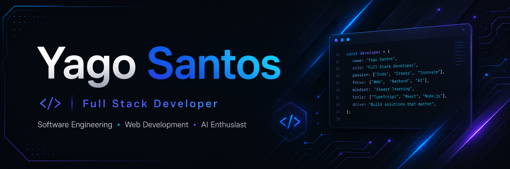

  

 

# Yago Santos

**Desenvolvedor Frontend &nbsp;·&nbsp; Engenharia da Computação &nbsp;·&nbsp; Gerente Max**

*Construindo interfaces modernas, escaláveis e de alta qualidade.*

 

---

## Sobre mim

Sou estudante de Engenharia da Computação e desenvolvedor Frontend, atualmente atuando na **Gerente Max** no desenvolvimento de uma plataforma ERP. Tenho experiência com React, TypeScript, Azure DevOps e Vanilla Extract CSS, além de experiência anterior no **Supremo Tribunal Federal (STF)**, onde atuei de agosto de 2023 a novembro de 2025.

Tenho interesse por desenvolvimento web, arquitetura de software, performance, qualidade de interface e construção de produtos digitais escaláveis.

 

---

## Atualmente focado em

 

| ⚡ Desenvolvimento Frontend | 🏗 Arquitetura de Software | 🎨 Qualidade de Interface |
|:---:|:---:|:---:|
| Interfaces modernas e performáticas com React, TypeScript e boas práticas de CSS | Padrões de projeto e construção de plataformas web escaláveis | Componentes consistentes, responsivos e bem estruturados para produtos digitais |

 

---

## Tecnologias

 

### Frontend

  

### Backend

  

### Banco de Dados

  

### Ferramentas

  

 

---

## Experiência

 

### Desenvolvedor Frontend — Gerente Max

**Fevereiro de 2026 — Atual**

Atuação no desenvolvimento de uma plataforma ERP, utilizando React, TypeScript, Azure DevOps e Vanilla Extract CSS, com foco em interfaces modernas, organização de código e experiência do usuário.

 

### Supremo Tribunal Federal (STF)

**Agosto de 2023 — Novembro de 2025**

Experiência em ambiente institucional, com participação em rotinas de desenvolvimento, manutenção e organização de sistemas, reforçando práticas de qualidade, responsabilidade e estruturação técnica.

 

---

## GitHub Stats

 

  

  
  

 

---

## Contribution Arcade

  <strong>Transformando consistência em código — um commit por vez.</strong>

  <picture>
    <source media="(prefers-color-scheme: dark)" srcset="https://raw.githubusercontent.com/Y4GoD957/Y4GoD957/output/pacman-contribution-graph-dark.svg">
    <source media="(prefers-color-scheme: light)" srcset="https://raw.githubusercontent.com/Y4GoD957/Y4GoD957/output/pacman-contribution-graph.svg">
    
  </picture>

 
